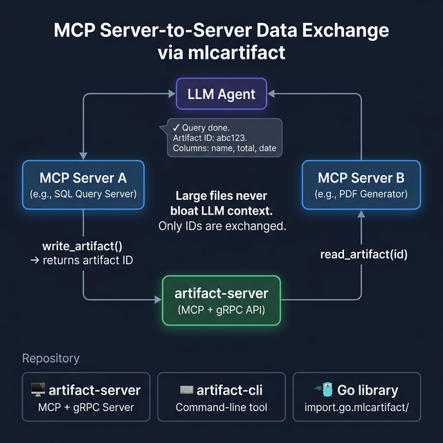

# mlcartifact — Der gemeinsame Speicher für MCP-Ökosysteme

> **Große Daten gehören nicht in den LLM-Kontext.** Lass MCP-Server Dateien direkt in einen gemeinsamen Speicher schreiben und nur eine ID austauschen. Das LLM orchestriert — ohne die Rohdaten je zu sehen.



[](https://pkg.go.dev/github.com/hmsoft0815/mlcartifact)
[](LICENSE)

Copyright (c) 2026 Michael Lechner. Lizenziert unter der MIT-Lizenz.

> 🇬🇧 [English Version](README.md)

---

## Das Problem: Große Daten gehören nicht in den LLM-Kontext

Stell dir vor: Ein SQL-MCP-Server liefert 50.000 Zeilen zurück. Oder ein Report-Generator erzeugt ein 2MB-PDF. Fließen diese Ergebnisse durch das Kontext-Fenster des LLMs:

- **Werden Tokens verschwendet** — massiv
- **Wird das Kontextlimit gesprengt** — häufig
- **Wird alles langsamer** — unnötig

**mlcartifact** ist die Lösung: ein gemeinsamer Artefakt-Speicher. MCP-Server schreiben Ergebnisse direkt hinein und teilen dem LLM nur mit: *„Fertig. Artefakt-ID: `abc123`. Spalten: name, summe, datum."*

---

## Das Muster: MCP-Server tauschen Daten direkt aus

```
LLM: "Führe den SQL-Quartalsbericht aus und erzeuge daraus ein PDF."

  MCP-Server A (SQL)      mlcartifact         MCP-Server B (PDF)
       │                       │                       │
       │── write_artifact() ──▶│                       │
       │   bericht.csv (2MB)   │                       │
       │◀── artifact ID: abc123│                       │
       │                       │                       │
       └── sagt LLM: "Fertig." │                       │
                               │                       │
LLM: "PDF-Server: erstelle aus Artefakt abc123 ein PDF."
                               │                       │
                               │◀── read_artifact(id) ─│
                               │    (liest 2MB CSV)    │
                               │──────────────────────▶│
```

**Die großen Daten fließen nie durch das LLM.** Nur Artefakt-IDs werden ausgetauscht. Das LLM orchestriert — es trägt keine Daten.

---

## Was ist in diesem Repository?

| Komponente | Beschreibung |
|---|---|
| **`artifact-server`** | MCP + gRPC Server. Speichert und liefert Artefakte. Unterstützt stdio und SSE. |
| **`artifact-cli`** | Kommandozeilen-Tool zum Hochladen, Herunterladen, Auflisten und Löschen. |
| **Go-Bibliothek** | `import "github.com/hmsoft0815/mlcartifact"` — direkt in jeden MCP-Server einbettbar. |

---

## Schnellstart

### Installation

```bash
# via Installations-Script (Linux/macOS)
curl -sfL https://raw.githubusercontent.com/hmsoft0815/mlcartifact/main/scripts/install.sh | sh

# oder via Go
go install github.com/hmsoft0815/mlcartifact/cmd/server@latest
go install github.com/hmsoft0815/mlcartifact/cmd/cli@latest
```

Vorkompilierte `.deb`, `.rpm` und Binaries unter **[GitHub Releases](https://github.com/hmsoft0815/mlcartifact/releases)**.

### Server starten

```bash
# stdio-Modus (für Claude Desktop / MCP)
artifact-server -data-dir /var/artifacts

# SSE/HTTP-Modus (für entfernte MCP-Server)
artifact-server -addr :8082 -grpc-addr :9590 -data-dir /var/artifacts
```

### Go-Bibliothek in deinem MCP-Server nutzen

```go
import "github.com/hmsoft0815/mlcartifact"

// Verbinden (liest ARTIFACT_GRPC_ADDR, Standard: :9590)
client, _ := mlcartifact.NewClient()
defer client.Close()

// Großes Ergebnis speichern — liefert eine ID, keine Daten
resp, _ := client.Write(ctx, "bericht.csv", csvDaten,
    mlcartifact.WithMimeType("text/csv"),
    mlcartifact.WithExpiresHours(24),
)

// Dem LLM mitteilen: "Fertig. ID: abc123. Spalten: name, summe, datum."
fmt.Println("artifact_id:", resp.Id)
```

---

## Claude Desktop Integration

```json
{
  "mcpServers": {
    "mlcartifact": {
      "command": "/pfad/zu/artifact-server",
      "args": ["-data-dir", "/dein/artifacts-pfad"]
    }
  }
}
```

Oder Verbindung zu einem laufenden Server via SSE:
```json
{
  "mcpServers": {
    "mlcartifact": {
      "sse": { "url": "http://localhost:8082/sse" }
    }
  }
}
```

---

## MCP-Tools

| Tool | Beschreibung |
|---|---|
| `write_artifact` | Datei speichern — liefert eine ID |
| `read_artifact` | Datei per ID oder Dateiname abrufen |
| `list_artifacts` | Gespeicherte Artefakte auflisten |
| `delete_artifact` | Dauerhaft löschen |

---

## CLI Nutzung

```bash
artifact-cli create ./bericht.csv --name "Q1-Bericht" --expires 72
artifact-cli download abc123 ./lokale-kopie.csv
artifact-cli list
artifact-cli delete abc123
```

Verbindung via `ARTIFACT_GRPC_ADDR` (Standard: `localhost:9590`) oder `-addr` Flag.

---

## Server-Konfiguration

| Flag | Standard | Beschreibung |
|---|---|---|
| `-addr` | _(leer)_ | SSE-Adresse. Leer = stdio-Modus. |
| `-grpc-addr` | `:9590` | gRPC-Adresse für Bibliotheks-Verbindungen |
| `-data-dir` | `.artifacts` | Speicherverzeichnis |
| `-mcp-list-limit` | `100` | Max. Einträge bei `list_artifacts` |

**Umgebungsvariablen (Bibliothek):**

| Variable | Beschreibung |
|---|---|
| `ARTIFACT_GRPC_ADDR` | gRPC-Adresse (Standard: `:9590`) |
| `ARTIFACT_SOURCE` | Standard-Quell-Tag |
| `ARTIFACT_USER_ID` | Standard-Benutzer-ID |

---

## Speicherstruktur

```
.artifacts/
├── global/
│   ├── {id}_{dateiname}
│   └── {id}_{dateiname}.json   # Metadaten-Sidecar
└── users/
    └── {user_id}/
        ├── {id}_{dateiname}
        └── {id}_{dateiname}.json
```

---

## Entwicklung

```bash
task test           # alle Tests ausführen
task build          # alle Binaries bauen
task build-server   # nur den Server bauen
```

---

## Roadmap

- [ ] **TypeScript / Node.js SDK**
- [ ] **Python SDK** (LangChain, AutoGen)
- [ ] **Docker Image** — vorkonfigurierter Server
- [ ] **Web Dashboard** — Artefakte im Browser verwalten

---

## Lizenz

MIT-Lizenz — Copyright (c) 2026 [Michael Lechner](https://github.com/hmsoft0815)
