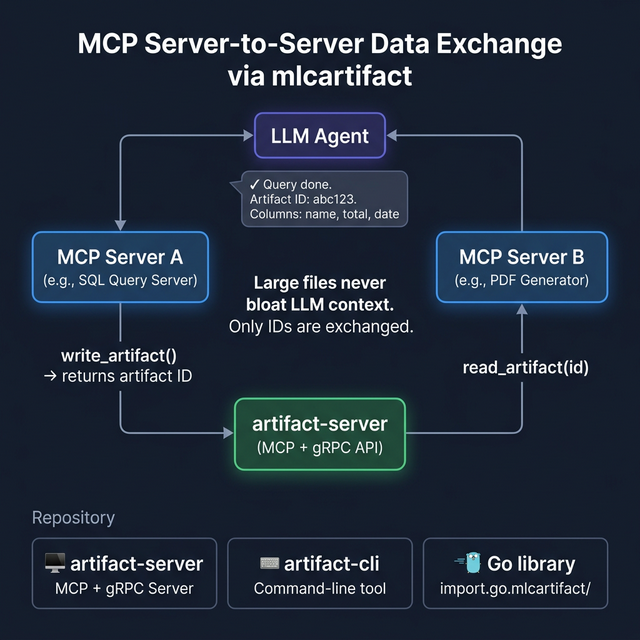

# mlcartifact - Der gemeinsame Speicher für MCP-Ökosysteme

> **[mlcgo.eu](https://mlcgo.eu)** — Werkzeuge, Bibliotheken und Handbücher · [Produktseite](https://mlcgo.eu/products/mlcartifact/)


> **Große Daten gehören nicht in den LLM-Kontext.** Lass MCP-Server Dateien direkt in einen gemeinsamen Speicher schreiben und nur eine ID austauschen. Das LLM orchestriert - ohne die Rohdaten je zu sehen.



[](https://pkg.go.dev/github.com/hmsoft0815/mlcartifact)
[](LICENSE)

Copyright (c) 2026 Michael Lechner. Lizenziert unter der MIT-Lizenz.

> [English Version](README.md)

---

## Das Problem: Große Daten gehören nicht in den LLM-Kontext

Stell dir vor: Ein SQL-MCP-Server liefert 50.000 Zeilen zurück. Oder ein Report-Generator erzeugt ein 2MB-PDF. Fließen diese Ergebnisse durch das Kontext-Fenster des LLMs:

- **Werden Tokens verschwendet** - massiv
- **Wird das Kontextlimit gesprengt** - häufig
- **Wird alles langsamer** - unnötig

**mlcartifact** ist die Lösung: ein gemeinsamer Artefakt-Speicher. MCP-Server schreiben Ergebnisse direkt hinein und teilen dem LLM nur mit: *„Fertig. Artefakt-ID: `abc123`. Spalten: name, summe, datum."*

---

## Für wen ist mlcartifact gedacht?

**mlcartifact ist in erster Linie für den Betrieb mit lokalen LLMs gedacht** (etwa über Ollama, llama.cpp oder LM Studio) und für eigene Harnesses. Dort gibt es meist keinen eingebauten Weg, auf dem Werkzeuge Dateien untereinander weiterreichen: Jedes Zwischenergebnis müsste durch den Kontext des Modells, und genau der ist bei lokaler Hardware knapp und langsam.

Professionelle Plattformen wie Claude (Anthropic) oder Gemini (Google) bringen in der Regel einen eigenen, vergleichbaren Mechanismus mit, zum Beispiel eine Sandbox mit Dateisystem oder eine Datei-API. Große Dateien bleiben dort zwischen zwei Tool-Aufrufen außerhalb des Modellkontexts und müssen gar nicht erst über das Netzwerk zum Modell und zurück. Wer eine solche Plattform nutzt, sollte zuerst deren eingebaute Lösung prüfen. mlcartifact lohnt sich dort vor allem dann, wenn eigene MCP-Server über einen gemeinsamen Speicher direkt Daten austauschen sollen.

---

## Das Muster: MCP-Server tauschen Daten direkt aus

```
LLM: "Führe den SQL-Quartalsbericht aus und erzeuge daraus ein PDF."

  MCP-Server A (SQL)      mlcartifact         MCP-Server B (PDF)
       |                       |                       |
       |-- write_artifact() -->|                       |
       |   bericht.csv (2MB)   |                       |
       |<-- artifact ID: abc123|                       |
       |                       |                       |
       +-- sagt LLM: "Fertig." |                       |
                               |                       |
LLM: "PDF-Server: erstelle aus Artefakt abc123 ein PDF."
                               |                       |
                               |<-- read_artifact(id) -|
                               |    (liest 2MB CSV)    |
                               |---------------------->|
```

**Die großen Daten fließen nie durch das LLM.** Nur Artefakt-IDs werden ausgetauscht. Das LLM orchestriert - es trägt keine Daten.

---

## Warum gRPC & das Artefakt-Muster?

Über einfache lokale Dateispeicherung hinaus nutzt `mlcartifact` einen gRPC-zentrierten Ansatz, um die spezifischen Herausforderungen verteilter MCP-Ökosysteme zu lösen:

- **Nahtlose Portabilität**: Dienste können auf dem Host, in Docker-Containern oder auf entfernten Servern laufen. Alle verbinden sich via gRPC ohne gemeinsame Volumes oder komplexe Dateisystemrechte.
- **Erhöhte Sicherheit (Sandboxing)**: MCP-Server benötigen keinen Vollzugriff auf das Dateisystem des Hosts. Sie interagieren nur mit der Artefakt-API, was eine sichere Grenze zwischen deinen Daten und potenziell unsicheren Tools schafft.
- **Multi-Server-Datenaustausch**: Ermöglicht das „Shared Memory“-Muster, bei dem Server A Daten schreibt und Server B sie liest, orchestriert durch das LLM über IDs.
- **Metadaten & Lebenszyklus**: Automatische MIME-Typ-Erkennung, Herkunftsnachweise und ein **automatisches Ablaufdatum**.

### Vergleich: gRPC API vs. Lokales Dateisystem

| Feature | `mlcartifact` (gRPC) | Lokales Dateisystem (`/tmp`, etc.) |
| :--- | :--- | :--- |
| **Isolierung** | **Hoch** (API-Grenze) | **Niedrig** (OS-Berechtigungen nötig) |
| **Portabilität** | **Universell** (Netzwerkbasiert) | **Host-gebunden** (Shared Volumes nötig) |
| **Benutzer-Isolation**| Eingebaute Scoping-Logik | Manuelle Rechteverwaltung |
| **Bereinigung** | Automatisch (TTL-basiert) | Manuell oder via Cron-Job |
| **Performance** | Netzwerklatenz (ms) | Festplattengeschwindigkeit |
| **Komplexität** | Benötigt Server-Prozess | Kein zusätzlicher Prozess |

**Abwägung (Tradeoffs)**: Obwohl gRPC eine geringe Netzwerklatenz einführt und einen laufenden Server-Prozess erfordert, überwiegen in produktiven MCP-Umgebungen die Vorteile in Bezug auf Sicherheit, Multi-Server-Orchestrierung und vereinfachtes Deployment meist deutlich.

---

## Was ist in diesem Repository?

| Komponente | Beschreibung |
|---|---|
| **`artifact-server`** | MCP + gRPC Server. Speichert und liefert Artefakte. MCP über stdio, Streamable HTTP (`/mcp`) und das ältere SSE (`/sse`), Protokoll 2026-07-28, gebaut auf dem offiziellen [MCP Go SDK](https://github.com/modelcontextprotocol/go-sdk). |
| **`artifact-cli`** | Kommandozeilen-Tool zum Hochladen, Herunterladen, Auflisten und Löschen. |
| **Go-Bibliothek** | `import "github.com/hmsoft0815/mlcartifact/client"` - direkt in jeden MCP-Server einbettbar. |
| **TypeScript-Client** | In `client-ts/` - universeller Client (Node, Browser, Edge) mittels Connect RPC. Installation: siehe [client-ts/README.de.md](client-ts/README.de.md). |
| **Python-Client** | In `client-python/` - Connect-Client auf Basis von httpx. |
| **Rust SDK** | In `client-rust/` - gRPC-Client mittels Tonic. |

Alle vier Clients decken die komplette API ab: Schreiben, Lesen, Auflisten, Löschen und die VFS-Funktionen (virtuelle Pfade, Verzeichnisse, Patch, Suche).

## Ökosystem & Verwandte Projekte

- **[wollmilchsau](https://github.com/hmsoft0815/wollmilchsau)** - Ein „Eierlegende-Wollmilchsau“-MCP-Server, der Scripte (Python, Bash, etc.) ausführen kann, die als Artefakte in `mlcartifact` gespeichert sind. Dies ermöglicht dynamische Tool-Ausführung, bei der das LLM ein Script in den Artefakt-Speicher schreibt und `wollmilchsau` es in einer sicheren Umgebung ausführt.

---

## Dokumentation

- **[Go-Client-Bibliothek Handbuch](docs/go_library.md)** - Umfassender Guide für Go-Entwickler.
- **[gRPC-API-Referenz](docs/grpc_messaging.md)** - Detaillierte technische Referenz für das gRPC-Protokoll.

---

## Schnellstart

### Installation

```bash
# via Installations-Script (Linux/macOS)
curl -sfL https://raw.githubusercontent.com/hmsoft0815/mlcartifact/main/scripts/install.sh | sh

# oder via Go
go install github.com/hmsoft0815/mlcartifact/cmd/artifact-server@latest
go install github.com/hmsoft0815/mlcartifact/cmd/artifact-cli@latest
```

Vorkompilierte `.deb`, `.rpm` und Binaries unter **[GitHub Releases](https://github.com/hmsoft0815/mlcartifact/releases)**.

### Server starten

```bash
# stdio-Modus (für Claude Desktop / MCP)
artifact-server -data-dir ~/mlcartifact/storage

# HTTP-Modus: Streamable HTTP auf /mcp, älteres SSE auf /sse
artifact-server -addr :8082 -grpc-addr :9590 -data-dir ~/mlcartifact/storage
```

### Go-Bibliothek in deinem MCP-Server nutzen

Siehe das **[Go-Client-Bibliothek Handbuch](docs/go_library.md)** für detaillierte Beispiele.

```go
import "github.com/hmsoft0815/mlcartifact/client"

// Verbinden (liest ARTIFACT_GRPC_ADDR, Standard: :9590)
c, _ := client.NewClient()
defer c.Close()

// Großes Ergebnis speichern - liefert eine ID, keine Daten
resp, _ := c.Write(ctx, "bericht.csv", csvDaten,
    client.WithMimeType("text/csv"),
    client.WithExpiresHours(24),
)

// Dem LLM mitteilen: "Fertig. ID: abc123. Spalten: name, summe, datum."
fmt.Println("artifact_id:", resp.Id)
```

---

## Claude Desktop Integration

```json
{
  "mcpServers": {
    "mlcartifact": {
      "command": "/pfad/zu/artifact-server",
      "args": ["-data-dir", "/dein/artifacts-pfad"]
    }
  }
}
```

Oder Verbindung zu einem laufenden Server über HTTP (der Server muss vorher gestartet sein). Aktuelle Clients nutzen Streamable HTTP; die genauen Schlüssel hängen vom Client ab:
```json
{
  "mcpServers": {
    "mlcartifact": {
      "type": "http",
      "url": "http://localhost:8082/mcp"
    }
  }
}
```

Ältere Clients, die nur SSE sprechen, nutzen weiterhin `http://localhost:8082/sse`.

---

## MCP-Tools

| Tool | Beschreibung |
|---|---|
| `write_artifact` | Datei speichern, optional unter einem `virtual_path` - liefert eine ID und einen `<file>`-Referenz-Tag |
| `read_artifact` | Datei per ID oder virtuellem Pfad abrufen |
| `list_artifacts` | Gespeicherte Artefakte auflisten (flach) |
| `vfs_ls` | Virtuelles Verzeichnis auflisten |
| `vfs_find` | Per Glob-Muster oder Stichwort suchen |
| `vfs_patch` | Zeilen ersetzen (`line_start` einschließlich, `line_end` ausschließlich) oder anhängen |
| `delete_artifact` | Dauerhaft löschen |

Alle Tools außer `read_artifact` liefern strukturierte Ergebnisse mit Output-Schema; Fehler kommen als Tool-Fehler (`isError`). Der Prompt `vfs_usage` erklärt dem Modell das virtuelle Dateisystem.

---

## CLI Nutzung

```bash
artifact-cli create ./bericht.csv --name "Q1-Bericht" --expires 72
artifact-cli download abc123 ./lokale-kopie.csv
artifact-cli list
artifact-cli delete abc123
```

Verbindung via `ARTIFACT_GRPC_ADDR` (Standard: `localhost:9590`) oder `-addr` Flag.

---

## Server-Konfiguration

| Flag | Standard | Beschreibung |
|---|---|---|
| `-addr` | _(leer)_ | HTTP-Adresse (z. B. `127.0.0.1:8080` für lokal, `:8080` für alle): Streamable HTTP auf `/mcp`, SSE auf `/sse`. Leer = stdio-Modus. |
| `-grpc-addr` | `:9590` | gRPC-Adresse (z. B. `127.0.0.1:9590` für lokal, `:9590` für alle). |
| `-data-dir` | `~/mlcartifact/storage` | Speicherverzeichnis |
| `-mcp-list-limit` | `100` | Max. Einträge bei `list_artifacts` |

**Umgebungsvariablen (Bibliothek):**

| Variable | Beschreibung |
|---|---|
| `ARTIFACT_GRPC_ADDR` | gRPC-Adresse (Standard: `:9590`) |
| `ARTIFACT_SOURCE` | Standard-Quell-Tag |
| `ARTIFACT_USER_ID` | Standard-Benutzer-ID |

---

## Speicherstruktur

```
~/mlcartifact/storage/
├── global/
│   ├── {id}_{dateiname}
│   └── {id}_{dateiname}.json   # Metadaten-Sidecar
└── users/
    └── {user_id}/
        ├── {id}_{dateiname}
        └── {id}_{dateiname}.json
```

---

## Entwicklung

```bash
task test           # alle Tests ausführen
task test:integration # gebauten Server über mcp-tester fahren (jedes Tool, jeder Parameter)
task build          # alle Binaries bauen
task build-server   # nur den Server bauen
```

---

## Beispiele ausführen

Das Repository enthält „Hello World“-Beispiele für alle unterstützten Sprachen. Diese Beispiele demonstrieren den vollständigen Lebenszyklus: 3 Artefakte schreiben, eines löschen und die anderen abrufen/verifizieren.

Um alle Beispiele gleichzeitig auszuführen (erfordert einen laufenden Server):
```bash
# 1. Server in einem Terminal starten
artifact-server -addr :8082 -grpc-addr :9590

# 2. Beispiele in einem anderen Terminal ausführen
make run-examples
```

Oder spezifische Beispiele ausführen:
- `make run-example-go`
- `make run-example-python`
- `make run-example-ts`
- `make run-example-rust`

---

## Roadmap

- [x] **TypeScript / Node.js SDK**
- [x] **Python SDK** (httpx, Connect-Protokoll)
- [x] **Docker Image** - vorkonfigurierter Server
- [x] **Rust SDK** (Tonic-basiert)
- [ ] **Web Dashboard** - Artefakte im Browser verwalten

## Referenz

Das **[MCP-Handbuch](https://mlcgo.eu/books/mcp-handbuch/)** erklärt das Model Context Protocol von Grund auf —
Tools, Resources, Prompts, Transporte, Sicherheit und das Artifact-Pattern.
Auf Deutsch und Englisch.

---

## Lizenz

MIT-Lizenz - Copyright (c) 2026 [Michael Lechner](https://github.com/hmsoft0815)
