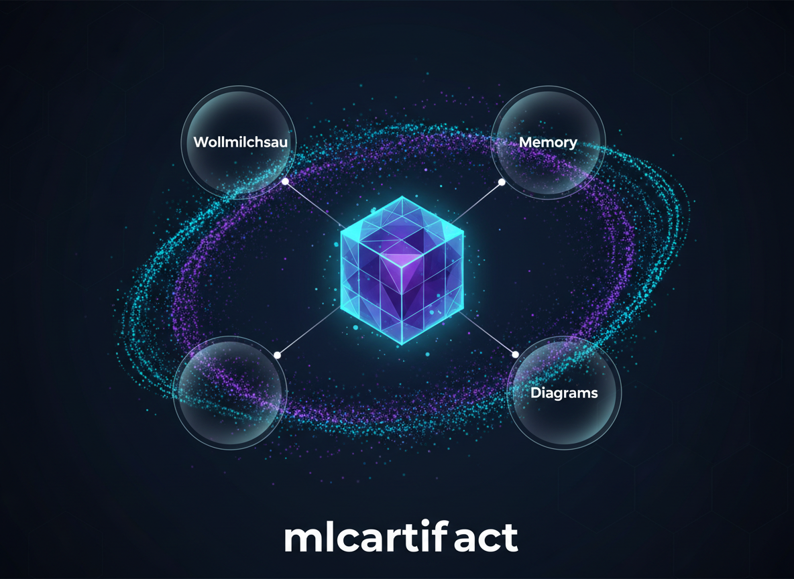

# mlcartifact



[](https://pkg.go.dev/github.com/hmsoft0815/mlcartifact)
[](LICENSE)

A Go library for communicating with the **artifact storage service** via gRPC.
Includes the server (`artifact-server`) and a command-line client (`artifact-cli`).

> 🇩🇪 [Deutsche Version](README.de.md)

## Why Model Context Protocol (MCP)?

AI agents often need to generate files (data, reports, code) or read existing context to perform tasks. The **Model Context Protocol** provides a standardized interface for agents to interact with tools.

`mlcartifact` solves the "fleeting context" problem:
- **Persistence**: Agents can save state or generated files that persist across sessions.
- **Collaboration**: Multiple agents (or even different MCP servers like `wollmilchsau`) can share and exchange data via a central hub.
- **Portability**: Files are stored in a standardized way and can be accessed via gRPC, HTTP/SSE, or standard I/O.

---

## Overview

`mlcartifact` provides a clean Go client to read, write, list and delete artifacts
from a shared storage service. It is designed to be used by AI agents and MCP servers
that need to exchange files (reports, code, data) across tool boundaries.

```
┌──────────────────────────────────────────────┐
│             Your App / MCP Server            │
│                                              │
│   import "github.com/hmsoft0815/mlcartifact" │
│   client, _ := mlcartifact.NewClient()       │
│   client.Write(ctx, "report.md", data)       │
└────────────────────┬─────────────────────────┘
                     │ gRPC (:9590)
           ┌─────────▼──────────┐
           │   artifact-server  │
           │  (MCP + gRPC API)  │
           └────────────────────┘
```

---

## Components

| Path | Description |
|------|-------------|
| `.` | Go library — `import "github.com/hmsoft0815/mlcartifact"` |
| `cmd/server` | Standalone artifact storage server (gRPC + MCP stdio/SSE) |
| `cmd/cli` | Command-line client for interacting with the server |

---

## Installation

### Library

```bash
go get github.com/hmsoft0815/mlcartifact
```

### Server & CLI binaries

```bash
# Server
go install github.com/hmsoft0815/mlcartifact/cmd/server@latest

# CLI
go install github.com/hmsoft0815/mlcartifact/cmd/cli@latest
```

---

## Quick Start

### Start the server

```bash
# Via stdio (default, for MCP integration)
artifact-server

# Via SSE (for network access)
artifact-server -addr :8082 -grpc-addr :9590 -data-dir /var/artifacts
```

### Use the library

```go
package main

import (
    "context"
    "fmt"

    "github.com/hmsoft0815/mlcartifact"
)

func main() {
    // Connects to ARTIFACT_GRPC_ADDR env var, defaults to :9590
    client, err := mlcartifact.NewClient()
    if err != nil {
        panic(err)
    }
    defer client.Close()

    ctx := context.Background()

    // Write an artifact
    resp, err := client.Write(ctx, "report.md", []byte("# Hello World"),
        mlcartifact.WithMimeType("text/markdown"),
        mlcartifact.WithExpiresHours(48),
    )
    if err != nil {
        panic(err)
    }
    fmt.Println("Artifact ID:", resp.Id)

    // Read it back
    data, err := client.Read(ctx, resp.Id)
    if err != nil {
        panic(err)
    }
    fmt.Println("Content:", string(data.Content))
}
```

---

## Configuration (Server)

| Flag | Default | Description |
|------|---------|-------------|
| `-addr` | _(empty)_ | SSE listen address. If empty, uses stdio. |
| `-grpc-addr` | `:9590` | gRPC listen address |
| `-data-dir` | `.artifacts` | Directory for artifact storage |
| `-mcp-list-limit` | `100` | Max items returned by `list_artifacts` |

### Environment Variables (Library)

| Variable | Description |
|----------|-------------|
| `ARTIFACT_GRPC_ADDR` | gRPC address to connect to (default: `:9590`) |
| `ARTIFACT_SOURCE` | Default source tag for written artifacts |
| `ARTIFACT_USER_ID` | Default user ID for artifact operations |

---

## MCP Tools

When running as an MCP server, `artifact-server` exposes these tools:

| Tool | Description |
|------|-------------|
| `write_artifact` | Save a file to the artifact store |
| `read_artifact` | Retrieve a file by ID or filename |
| `list_artifacts` | List all artifacts for a user |
| `delete_artifact` | Delete an artifact permanently |

---

## Storage Layout

```
.artifacts/
├── global/              # Artifacts without a user ID
│   ├── {id}_{filename}
│   └── {id}_{filename}.json  # Metadata sidecar
└── users/
    └── {user_id}/
        ├── {id}_{filename}
        └── {id}_{filename}.json
```

---

## Development

```bash
# Run all tests
task test

# Build all binaries
task build

# Build server only
task build-server
```

See the [Taskfile](Taskfile.yml) for all available commands.

---

## Roadmap

- [ ] **TypeScript / Node.js SDK**: For building Node-based MCP servers and web integrations.
- [ ] **Python SDK**: For seamless integration into the AI/ML ecosystem (LangChain, AutoGen).
- [ ] **Docker Image**: Pre-configured `artifact-server` for easy deployment.
- [ ] **Visual Dashboard**: A web interface to browse and manage stored artifacts.

---

## License

MIT License — Copyright (c) 2026 [Michael Lechner](https://github.com/hmsoft0815)
