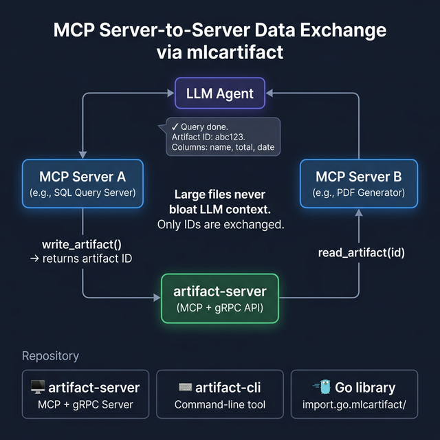

# mlcartifact — The Shared Memory Layer for MCP Ecosystems

> **Don't route large data through the LLM.** Let MCP servers write files to a shared store and exchange only an ID. The LLM decides what to do next — without ever seeing the raw data.



[](https://pkg.go.dev/github.com/hmsoft0815/mlcartifact)
[](LICENSE)

Copyright (c) 2026 Michael Lechner. Licensed under the MIT License.

> 🇩🇪 [Deutsche Version](README.de.md)

---

## The Problem: Large Data Doesn't Belong in LLM Context

Imagine a SQL MCP server that returns 50,000 rows. Or a report generator that produces a 2MB PDF. If these results flow through the LLM's context window, you:

- **Waste tokens** — massively
- **Hit context limits** — frequently
- **Slow everything down** — unnecessarily

**mlcartifact** is the solution: a shared artifact store. MCP servers write their output directly to it and tell the LLM only: *"Done. Artifact ID: `abc123`. Columns: name, total, date."*

---

## The Pattern: MCP Server-to-Server Data Exchange

```
LLM: "Run the quarterly SQL report and turn it into a PDF."

  MCP Server A (SQL)       mlcartifact         MCP Server B (PDF)
       │                       │                       │
       │── write_artifact() ──▶│                       │
       │   report.csv (2MB)    │                       │
       │◀── artifact ID: abc123│                       │
       │                       │                       │
       └── tells LLM: "Done."  │                       │
                               │                       │
LLM: "PDF Server: generate a PDF from artifact abc123."
                               │                       │
                               │◀── read_artifact(id) ─│
                               │    (reads 2MB CSV)    │
                               │──────────────────────▶│
```

**The big data never flows through the LLM.** Only artifact IDs are exchanged. The LLM orchestrates — it doesn't carry data.

---

## What's in This Repository

| Component | Description |
|---|---|
| **`artifact-server`** | MCP + gRPC server. Stores and serves artifacts. Speaks stdio and SSE. |
| **`artifact-cli`** | Command-line tool to upload, download, list, and delete artifacts. |
| **Go library** | `import "github.com/hmsoft0815/mlcartifact"` — embed directly in any MCP server. |
| **TypeScript client** | `npm install @hmsoft0815/mlcartifact-client` — Universal client (Node, Browser, Edge) using Connect RPC. |

---

## Documentation

- **[gRPC Messaging & Go Client Library](docs/grpc_messaging.md)** — Detailed technical guide for using the Go library and gRPC API.

---

## Quick Start

### Install

```bash
# via install script (Linux/macOS)
curl -sfL https://raw.githubusercontent.com/hmsoft0815/mlcartifact/main/scripts/install.sh | sh

# or via Go
go install github.com/hmsoft0815/mlcartifact/cmd/server@latest
go install github.com/hmsoft0815/mlcartifact/cmd/cli@latest
```

Pre-built `.deb`, `.rpm`, and binaries on **[GitHub Releases](https://github.com/hmsoft0815/mlcartifact/releases)**.

### Start the Server

```bash
# stdio mode (for Claude Desktop / MCP)
artifact-server -data-dir /var/artifacts

# SSE/HTTP mode (for remote MCP servers)
artifact-server -addr :8082 -grpc-addr :9590 -data-dir /var/artifacts
```

### Use the Go Library in Your MCP Server

See the **[Go Client Documentation](docs/grpc_messaging.md)** for detailed usage and examples.

```go
import "github.com/hmsoft0815/mlcartifact"

// Connect (reads ARTIFACT_GRPC_ADDR env var, defaults to :9590)
client, _ := mlcartifact.NewClient()
defer client.Close()

// Store a large result — returns an ID, not the data
resp, _ := client.Write(ctx, "report.csv", csvData,
    mlcartifact.WithMimeType("text/csv"),
    mlcartifact.WithExpiresHours(24),
)

// Tell the LLM: "Done. ID: abc123. Columns: name, total, date."
fmt.Println("artifact_id:", resp.Id)
```

---

## Claude Desktop Integration

```json
{
  "mcpServers": {
    "mlcartifact": {
      "command": "/path/to/artifact-server",
      "args": ["-data-dir", "/your/artifacts"]
    }
  }
}
```

Or connect to a running instance via SSE:
```json
{
  "mcpServers": {
    "mlcartifact": {
      "sse": { "url": "http://localhost:8082/sse" }
    }
  }
}
```

---

## MCP Tools

| Tool | Description |
|---|---|
| `write_artifact` | Save a file — returns an ID |
| `read_artifact` | Retrieve a file by ID or filename |
| `list_artifacts` | List stored artifacts |
| `delete_artifact` | Delete permanently |

---

## CLI Usage

```bash
artifact-cli create ./report.csv --name "Q1 Report" --expires 72
artifact-cli download abc123 ./local-copy.csv
artifact-cli list
artifact-cli delete abc123
```

Connect via `ARTIFACT_GRPC_ADDR` env var (default: `localhost:9590`) or `-addr` flag.

---

## Server Configuration

| Flag | Default | Description |
|---|---|---|
| `-addr` | _(empty)_ | SSE listen address. Empty = stdio mode. |
| `-grpc-addr` | `:9590` | gRPC address for library connections |
| `-data-dir` | `.artifacts` | Storage directory |
| `-mcp-list-limit` | `100` | Max items from `list_artifacts` |

**Environment variables (library):**

| Variable | Description |
|---|---|
| `ARTIFACT_GRPC_ADDR` | gRPC server address (default: `:9590`) |
| `ARTIFACT_SOURCE` | Default source tag |
| `ARTIFACT_USER_ID` | Default user ID |

---

## Storage Layout

```
.artifacts/
├── global/
│   ├── {id}_{filename}
│   └── {id}_{filename}.json   # metadata sidecar
└── users/
    └── {user_id}/
        ├── {id}_{filename}
        └── {id}_{filename}.json
```

---

## Development

```bash
task test         # run all tests
task build        # build all binaries
task build-server # server only
```

---

## Roadmap

- [x] **TypeScript / Node.js SDK**
- [ ] **Python SDK** (LangChain, AutoGen)
- [ ] **Docker Image** — pre-configured server
- [ ] **Web Dashboard** — browse & manage artifacts visually

---

## License

MIT License — Copyright (c) 2026 [Michael Lechner](https://github.com/hmsoft0815)
