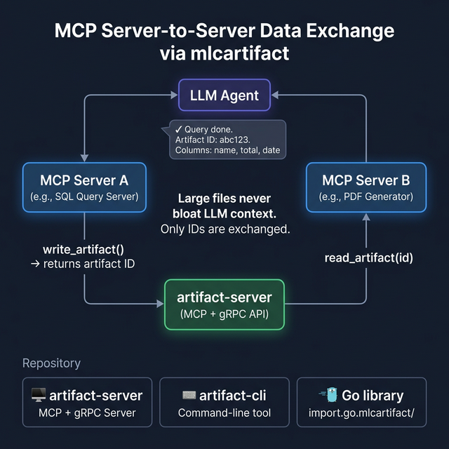

# mlcartifact - The Shared Memory Layer for MCP Ecosystems

> **[mlcgo.eu](https://mlcgo.eu)** — tools, libraries and manuals · [Product page](https://mlcgo.eu/products/mlcartifact/)


> **Don't route large data through the LLM.** Let MCP servers write files to a shared store and exchange only an ID. The LLM decides what to do next - without ever seeing the raw data.



[](https://pkg.go.dev/github.com/hmsoft0815/mlcartifact)
[](LICENSE)

Copyright (c) 2026 Michael Lechner. Licensed under the MIT License.

> [Deutsche Version](README.de.md)

---

## The Problem: Large Data Doesn't Belong in LLM Context

Imagine a SQL MCP server that returns 50,000 rows. Or a report generator that produces a 2MB PDF. If these results flow through the LLM's context window, you:

- **Waste tokens** - massively
- **Hit context limits** - frequently
- **Slow everything down** - unnecessarily

**mlcartifact** is the solution: a shared artifact store. MCP servers write their output directly to it and tell the LLM only: *"Done. Artifact ID: `abc123`. Columns: name, total, date."*

---

## Who Is This For?

**mlcartifact is primarily meant for local LLM setups** (for example via Ollama, llama.cpp or LM Studio) and for custom harnesses. These usually have no built-in way for tools to hand files to each other: every intermediate result would have to pass through the model's context, which is exactly what is scarce and slow on local hardware.

Professional platforms such as Claude (Anthropic) or Gemini (Google) usually ship a comparable mechanism of their own, such as a sandbox with a file system or a files API. Large files stay outside the model's context between tool calls and never have to travel over the network to the model and back. If you use such a platform, check its built-in solution first. There, mlcartifact mainly pays off when your own MCP servers should exchange data directly through a shared store.

---

## The Pattern: MCP Server-to-Server Data Exchange

```
LLM: "Run the quarterly SQL report and turn it into a PDF."

  MCP Server A (SQL)       mlcartifact         MCP Server B (PDF)
       |                       |                       |
       |-- write_artifact() -->|                       |
       |   report.csv (2MB)    |                       |
       |<-- artifact ID: abc123|                       |
       |                       |                       |
       +-- tells LLM: "Done."  |                       |
                               |                       |
LLM: "PDF Server: generate a PDF from artifact abc123."
                               |                       |
                               |<-- read_artifact(id) -|
                               |    (reads 2MB CSV)    |
                               |---------------------->|
```

**The big data never flows through the LLM.** Only artifact IDs are exchanged. The LLM orchestrates - it doesn't carry data.

---

## Why gRPC & The Artifact Pattern?

Moving beyond simple local file storage, `mlcartifact` uses a gRPC-first approach to solve the unique challenges of distributed MCP ecosystems:

- **Seamless Portability**: Services can run on the host, in Docker containers, or on remote servers. They all connect via gRPC without needing shared volumes or complex filesystem permissions.
- **Enhanced Security (Sandboxing)**: MCP servers don't need broad access to your host's filesystem. They only interact with the Artifact API, providing a secure boundary between your data and potentially untrusted tools.
- **Multi-Server Data Exchange**: Enables the "Shared Memory" pattern where Server A writes data and Server B reads it, orchestrated by the LLM using only IDs.
- **Rich Metadata & Lifecycle**: Automatic handling of MIME types, source tracking, and **automatic expiration**.

### Comparison: gRPC API vs. Local Filesystem

| Feature | `mlcartifact` (gRPC) | Local Filesystem (`/tmp`, etc.) |
| :--- | :--- | :--- |
| **Isolation** | **High** (API-defined boundary) | **Low** (Requires broad OS permissions) |
| **Portability** | **Universal** (Network based) | **Host-locked** (Requires shared volumes) |
| **Multi-User** | Built-in scoping | Manual permission management |
| **Cleanup** | Automatic (TTL-based) | Manual or cron-job required |
| **Performance** | Network latency (ms) | Disk I/O speed |
| **Complexity** | Requires server process | No extra process |

**Tradeoffs**: While gRPC introduces a small network latency and requires a running server process, the benefits in terms of security, multi-server orchestration, and simplified deployment usually far outweigh these costs in production MCP environments.

---

## What's in This Repository

| Component | Description |
|---|---|
| **`artifact-server`** | MCP + gRPC server. Stores and serves artifacts. MCP over stdio, Streamable HTTP (`/mcp`) and legacy SSE (`/sse`), protocol 2026-07-28, built on the official [MCP Go SDK](https://github.com/modelcontextprotocol/go-sdk). |
| **`artifact-cli`** | Command-line tool to upload, download, list, and delete artifacts. |
| **Go library** | `import "github.com/hmsoft0815/mlcartifact/client"` - embed directly in any MCP server. |
| **TypeScript client** | In `client-ts/` - universal client (Node, Browser, Edge) using Connect RPC. Installation: see [client-ts/README.md](client-ts/README.md). |
| **Python client** | In `client-python/` - Connect client using httpx. |
| **Rust SDK** | In `client-rust/` - gRPC client using Tonic. |

All four clients cover the full API: write, read, list, delete and the VFS operations (virtual paths, directory listing, patch, find).

## Ecosystem & Related Projects

- **[wollmilchsau](https://github.com/hmsoft0815/wollmilchsau)** - A "Swiss Army Knife" MCP server that can execute JavaScript (TypeScript) scripts stored as artifacts in `mlcartifact`. It allows for dynamic tool execution where the LLM writes a script to the artifact store and `wollmilchsau` executes it in a secure environment.
- **[mcp-tester](https://github.com/hmsoft0815/mlc_mcptester)** - A CLI testing tool and script runner for MCP servers. Used in `mlcartifact` to integration-test every MCP tool and parameter with declarative assertions.

---

## Documentation

- **[Go Client Library Guide](docs/go_library.md)** - Comprehensive guide for Go developers.
- **[Python Client](client-python/README.md)** - Implementation and usage for Python developers.
- **[gRPC API Reference](docs/grpc_messaging.md)** - Detailed technical reference for the gRPC protocol.

---

## Quick Start

### Install

```bash
# via install script (Linux/macOS)
curl -sfL https://raw.githubusercontent.com/hmsoft0815/mlcartifact/main/scripts/install.sh | sh

# or via Go
go install github.com/hmsoft0815/mlcartifact/cmd/artifact-server@latest
go install github.com/hmsoft0815/mlcartifact/cmd/artifact-cli@latest
```

Pre-built `.deb`, `.rpm`, and binaries on **[GitHub Releases](https://github.com/hmsoft0815/mlcartifact/releases)**.

### Start the Server

```bash
# stdio mode (for Claude Desktop / MCP)
artifact-server -data-dir ~/mlcartifact/storage

# HTTP mode: Streamable HTTP on /mcp, legacy SSE on /sse
artifact-server -addr :8082 -grpc-addr :9590 -data-dir ~/mlcartifact/storage
```

### Use the Go Library in Your MCP Server

See the **[Go Client Library Guide](docs/go_library.md)** for detailed usage and examples.

```go
import "github.com/hmsoft0815/mlcartifact/client"

// Connect (reads ARTIFACT_GRPC_ADDR env var, defaults to :9590)
c, _ := client.NewClient()
defer c.Close()

// Store a large result - returns an ID, not the data
resp, _ := c.Write(ctx, "report.csv", csvData,
    client.WithMimeType("text/csv"),
    client.WithExpiresHours(24),
)

// Tell the LLM: "Done. ID: abc123. Columns: name, total, date."
fmt.Println("artifact_id:", resp.Id)
```

---

## Claude Desktop Integration

```json
{
  "mcpServers": {
    "mlcartifact": {
      "command": "/path/to/artifact-server",
      "args": ["-data-dir", "/your/artifacts"]
    }
  }
}
```

Or connect to a running instance over HTTP (the server must be started first). Current clients use Streamable HTTP; the exact config keys depend on your client:
```json
{
  "mcpServers": {
    "mlcartifact": {
      "type": "http",
      "url": "http://localhost:8082/mcp"
    }
  }
}
```

Older clients that only speak SSE can still use `http://localhost:8082/sse`.

---

## MCP Tools

| Tool | Description |
|---|---|
| `write_artifact` | Save a file, optionally under a `virtual_path` - returns an ID and a `<file>` reference tag |
| `read_artifact` | Retrieve a file by ID or virtual path |
| `list_artifacts` | List stored artifacts (flat) |
| `vfs_ls` | List a virtual directory |
| `vfs_find` | Search by glob pattern or keyword |
| `vfs_patch` | Replace lines (`line_start` inclusive, `line_end` exclusive) or append |
| `delete_artifact` | Delete permanently |

All tools except `read_artifact` return structured results with an output schema; errors are reported as tool errors (`isError`). The prompt `vfs_usage` explains the virtual file system to the model.

---

## CLI Usage

```bash
# Upload, download, list, delete
artifact-cli create ./report.csv --name "Q1 Report" --expires 72
artifact-cli create -q ./script.sh             # quiet mode: prints only the artifact ID
artifact-cli download abc123 ./local-copy.csv
artifact-cli list
artifact-cli delete abc123
```

Global options:
- `-addr`: gRPC server address (default: `ARTIFACT_GRPC_ADDR` or `localhost:9590`)
- `-token`: Authentication token for remote access (default: `ARTIFACT_GRPC_TOKEN` or `ARTIFACT_TOKEN`)
- `-user`: User ID scope (default: `ARTIFACT_USER_ID`)

---

## Server Configuration

| Flag | Default | Description |
|---|---|---|
| `-addr` | _(empty)_ | HTTP listen address (e.g. `127.0.0.1:8080` or `:8080` for local, `0.0.0.0:8080` for all): Streamable HTTP on `/mcp`, SSE on `/sse`. Non-loopback requires token. Empty = stdio mode. |
| `-grpc-addr` | `127.0.0.1:9590` | gRPC/Connect listen address (e.g. `127.0.0.1:9590` or `:9590` for local, `0.0.0.0:9590` for all interfaces). Non-loopback requires token. |
| `-grpc-token` | _(empty)_ | Authentication token required for remote (non-loopback) access. Can also be set via `ARTIFACT_GRPC_TOKEN`. |
| `-require-token-localhost` | `false` | Require authentication token even for localhost / loopback connections (default: false, localhost connects without token). |
| `-cors-origins` | _(empty)_ | Comma-separated list of allowed browser CORS origins (default: none / all cross-origin browser requests denied). |
| `-data-dir` | `~/mlcartifact/storage` | Storage directory |
| `-mcp-list-limit` | `100` | Max items from `list_artifacts` |

**Environment variables (library & server):**

| Variable | Description |
|---|---|
| `ARTIFACT_GRPC_ADDR` | gRPC server address (default: `127.0.0.1:9590`) |
| `ARTIFACT_GRPC_TOKEN` | Authentication token for remote access (also checks `ARTIFACT_TOKEN`; ignored for localhost unless required) |
| `ARTIFACT_REQUIRE_TOKEN_LOCALHOST` | Set to `true` or `1` to require token even for localhost connections |
| `ARTIFACT_CORS_ORIGINS` | Comma-separated list of allowed browser CORS origins |
| `ARTIFACT_SOURCE` | Default source tag |
| `ARTIFACT_USER_ID` | Default user ID |

---

## Authentication & Security

`mlcartifact` is designed for secure-by-default operation:

- **Localhost by default (Zero Config)**: Connections originating from loopback addresses (`127.0.0.1`, `::1`) do **not** require an authentication token by default. You can run the server locally and connect immediately with CLI or SDKs.
- **Remote Access (Token Required)**: If the server listens on a non-loopback interface (e.g. `0.0.0.0` or a public IP), the server **requires** an authentication token for all remote requests. Configure the token on the server via `-grpc-token <token>` or `ARTIFACT_GRPC_TOKEN=<token>`.
- **Enforcing Token on Localhost**: To require a token even for loopback connections (e.g. on shared developer machines), pass `-require-token-localhost` or set `ARTIFACT_REQUIRE_TOKEN_LOCALHOST=true`.
- **CORS Protection**: Cross-origin browser requests are blocked by default. Specific allowed origins can be configured with `-cors-origins "https://example.com"`.

### Configuring Tokens in Clients

All clients automatically check the `ARTIFACT_GRPC_TOKEN` (or `ARTIFACT_TOKEN`) environment variable and provide programmatic options:

- **CLI**: `artifact-cli -token "<token>" ...` or via `ARTIFACT_GRPC_TOKEN`
- **Go**: `client.NewClientWithAddr(addr, client.WithToken("<token>"))`
- **TypeScript**: `new ArtifactClient(addr, undefined, "<token>")`
- **Python**: `ArtifactClient(addr, token="<token>")`
- **Rust**: `ArtifactClient::connect_with_token(addr, "<token>")` or via `ARTIFACT_GRPC_TOKEN`
- **HTTP / MCP**: Provide the `Authorization: Bearer <token>` header

---

## Storage Layout

```
~/mlcartifact/storage/
├── global/
│   ├── {id}_{filename}
│   └── {id}_{filename}.json   # metadata sidecar
└── users/
    └── {user_id}/
        ├── {id}_{filename}
        └── {id}_{filename}.json
```

---

## Development & Testing

```bash
# Run unit tests across all components (Go, TS, Python, Rust)
task test:all             # or: make test-all

# Run integration tests with mcp-tester
task test:integration     # or: make test-integration

# Build binaries
task build                # or: make build
```

### MCP Server Integration Testing with `mcp-tester`

The MCP server implementation is thoroughly tested against the MCP specification and tool contracts using **[mcp-tester](https://github.com/hmsoft0815/mlc_mcptester)** (tested against **v1.6.2**).

- **Test Suite**: [`tests/integration.mcp`](tests/integration.mcp)
- **Score**: **54 / 54 assertions passed (100% pass rate, 0 failed)**
- **Coverage**:
  - All 7 MCP tools: `write_artifact`, `read_artifact`, `list_artifacts`, `vfs_ls`, `vfs_find`, `vfs_patch`, `delete_artifact`
  - Every required and optional parameter (`virtual_path`, `mime_type`, `description`, `expires_in_hours`, `metadata`, `user_id`, `line_start`, `line_end`, `append`)
  - Multi-user / multi-tenant data isolation (`user_id` separation between users)
  - VFS line patching (precise line replacement and append mode)
  - Negative tests and error handling (missing required fields, empty payloads, invalid IDs/paths)

Run the integration test suite:
```bash
task test:integration
# or
make test-integration
```

---

## Roadmap

- [x] **TypeScript / Node.js SDK**
- [x] **Python SDK** (httpx, Connect protocol)
- [x] **Docker Image** - pre-configured server
- [x] **Rust SDK** (Tonic based)
- [ ] **Web Dashboard** - browse & manage artifacts visually

## Reference

The **[MCP Handbook](https://mlcgo.eu/books/mcp-handbuch/)** explains the Model Context Protocol from the ground
up — tools, resources, prompts, transports, security and the artifact pattern.
Available in English and German.

---

## License

MIT License - Copyright (c) 2026 [Michael Lechner](https://github.com/hmsoft0815)

<!-- mlcai-private -->
## Project documentation (`.mlcai/`)

`.mlcai/` is a **private git submodule**: internal planning, backlog and work notes, maintained with the MLC Doc Hub. It is not publicly accessible — clone **without** `--recurse-submodules`; the build does not need it. Links into `.mlcai/` only work with access (`git submodule update --init .mlcai`).

## Who is "Claude" in the commits?

Some commits in this repository are co-authored by Claude, Anthropic's AI
model. It helps write code, keeps our documentation and backlog up to date and
digs through failing builds — every change is reviewed before it is merged.
We don't hide it: [how we work with Claude](https://mlcgo.eu/ai/en.html).
